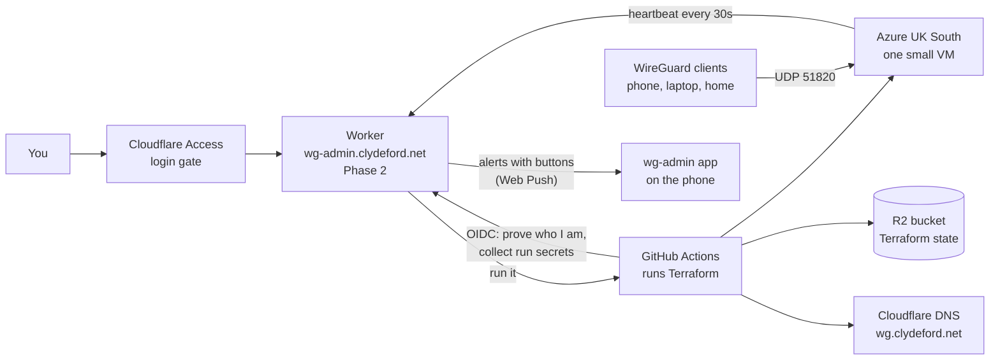

# wg-admin: an on-demand WireGuard concentrator in Azure

A VPN headend that only exists while you want it. One click builds a small
Azure VM running WireGuard, points **wg.clydeford.net** at it, proves the tunnel
works with a built-in self-test, and shows you who is connected. Another click
tears it all down and the Azure bill goes back to £0, or hibernates it into a
cheap warm standby that comes back in about a minute. Your phones and laptops
never change: they always dial the same name and trust the same server key.

Everything that manages it runs on Cloudflare and GitHub, both on free tiers.
Nothing runs in the homelab except the WireGuard clients themselves.

> **Status:** the dashboard is live at **https://wg-admin.clydeford.net**
> (Cloudflare Access login). Deploy, hibernate, resume, tear down, add clients
> by QR, watch the live log, see cost, get phone alerts with buttons. The full
> design is in [wg-admin-spec.md](wg-admin-spec.md).

## The picture



## The moving parts, in networking terms

| Part | What it is | Think of it as |
| --- | --- | --- |
| **Terraform** (`infra/`) | A description of every Azure object: resource group, VNet, subnet, NSG, public IP, NIC, VM, plus the DNS record. `apply` builds it, `destroy` removes it. | A config template you push to a new site, and pull back when the site closes |
| **cloud-init** (`infra/cloud-init.yaml.tftpl`) | A script Azure hands the VM on first boot. Installs WireGuard, writes its config, opens the tunnel, starts the heartbeat. | Zero-touch provisioning, like Cisco ZTP or a Meraki claiming itself |
| **The agent** (`infra/agent/`) | A 30-second systemd timer on the VM that POSTs `wg show` output to the Worker and applies any new peers the Worker sends back. It also pings each connected client (latency) and passes on the self-test result. | SNMP traps plus IP SLA probes plus a tiny config-push channel |
| **The self-test** (`infra/agent/wg-selftest.sh`) | At every boot a throwaway client inside the VM dials the headend and checks handshake, ping, tunnel DNS and the internet (IPv4 and IPv6) through NAT. The dashboard says "Verifying" until it passes. | A loopback test plug on a new circuit before handing it over |
| **Tunnel DNS** (dnsmasq on the VM) | A resolver on 10.13.255.1, reachable only through the tunnel. Blocks advert and tracker names from a public list and answers names like `laptop.wg`, `phone.wg`, `vm.wg`. Full-tunnel clients always use it; split-tunnel ones by choice. | The headend's DNS proxy, with a sinkhole |
| **GitHub Actions** (`.github/workflows/wg.yml`) | The machine that actually runs Terraform. It logs into Azure and Cloudflare with secrets, runs apply or destroy, backs up state, reports back. | The NOC engineer who types the change |
| **R2 bucket** `wg-admin-tfstate` | Where Terraform keeps its inventory of what it built. Locked during a run so two runs cannot collide. | The startup-config; lose it and the box still runs but you no longer know what you have |
| **wg.clydeford.net** | An A record, TTL 60, DNS-only (grey cloud). Points at the VM while it exists; parked on the reserved address 192.0.2.1 while destroyed, so it always resolves and nobody caches a "no such host". | A DDNS name: the name is stable, the address behind it is disposable |
| **Cloudflare Access** | Login gate for the dashboard. Only stevie.johnston@gmail.com gets in. Three narrow paths skip it and prove themselves another way: the VM heartbeat and the GitHub callback (per-run tokens), and the phone buttons (single-use links). | MFA on the management plane |
| **Phone alerts** (Web Push) | The installed wg-admin app gets notifications like any app. The Worker encrypts each alert to the phone's own key and signs it with the dashboard's VAPID key; Google's push service delivers it without being able to read it. | A pager whose messages only your handset can decrypt |
| **The Worker** (Phase 2) | The dashboard and API at wg-admin.clydeford.net. | The management plane |

## Setup, once

You need: [Node.js](https://nodejs.org) 20+, [GitHub CLI](https://cli.github.com) (`gh auth login`), and
[Terraform](https://developer.hashicorp.com/terraform/install) 1.10+ for local validation.

1. **Fill in `.env`.** Copy `.env.example` to `.env` if you do not have one. Every
   key has a comment saying what it is and where to get it. The values marked
   `REPLACE_ME` are the only ones you must mint by hand; the comments tell you
   where in each dashboard to click.

2. **Server key.** If `WG_SERVER_PRIVATE_KEY` is blank:

   ```sh
   npm run keys
   ```

   This is the one key every client trusts. It is generated once and kept
   forever. `npm run keys` refuses to overwrite it unless you pass `--rotate`.
   Copy the printed `WG_SERVER_PUBLIC_KEY` into `wrangler.toml`: the dashboard
   only ever holds the public half, so a compromised dashboard cannot
   impersonate the VPN server.

3. **Push secrets to GitHub.** Terraform in Actions reads them from there.

   ```sh
   npm run secrets -- --dry-run   # shows what it would set, never the values
   npm run secrets
   ```

   It refuses to run while any `REPLACE_ME` remains. If the narrow DNS token
   is not minted yet it will use the broad token with a loud warning, so you
   can test before tightening.

4. **Check the Terraform** (no cloud calls):

   ```sh
   npm run tf-validate
   npm test
   ```

## Using the dashboard

Open **https://wg-admin.clydeford.net** and sign in with Google, or with the
one-time PIN sent to your email (Cloudflare Access; only your address is allowed). On a phone, use "Add to Home Screen": it
installs as an app with its own icon, and the login lasts 24 hours.
Settings > **Install the app** walks you through it: an Install button on
Android (Chrome), the three Safari taps on an iPhone, and on a computer a QR
code to open the dashboard on the phone. The app manifest and icons are
public (their own Access bypass); everything else stays behind the login.

On a phone the dashboard is slimmed right down: every tab fits one screen,
with the sections in a tab bar at the bottom. Each tab shows a few status
lights (green, amber, red, grey) and a handful of buttons: Overview has the
state, the tunnel picture, four lights and Deploy / Extend / Hibernate /
Resume / Tear down; Clients is one line per device. Everything else (the full
facts, lists, forms, a client's details) sits in a sheet that slides up from
the bottom when you tap its button, and Done puts it away. The desktop layout
is unchanged.

| Screen | What it does |
| --- | --- |
| **Overview** | The big state word and the tunnel diagram. Deploy (choose how long for, and where: away from home it offers the nearest Azure region), Hibernate, Resume, Tear down (type `destroy`), extend or clear the auto-destroy, cancel a run, clean up after a failure. The self-test result, tunnel DNS and IPv6 address. Hover the Home tile for per-client latency and "changed networks". While a run is in progress you see the GitHub steps and the live log. |
| **Clients** | Every phone and laptop with its tunnel addresses (IPv4 and IPv6), online/offline, last handshake, latency and traffic. Add a client: the keys are made in your browser, the private key never leaves it, and you get a QR code to scan with the WireGuard app. Per client: Azure route and tunnel DNS on or off. Disable or delete a client; a running VM picks the change up within 30 seconds. |
| **Activity** | Every deploy and tear-down with how long it took and what it cost, plus the watchman's notes (drift, cost guard, missing heartbeat). |
| **Cost** | This session ticking up, this month's actual spend from Azure against a soft budget, daily bars, and each past session. |
| **Settings** | Region, VM size, default auto-destroy, what the timer does (tear down or hibernate), the Standby limit, idle limit, budget, SSH allow-list. The setup checklist, phone alerts, the run lock, and the server public key. |

The watchman (a 5-minute cron in the Worker) warns your phone 15 minutes
before the timer ends, tears down (or hibernates) when it passes, tears down
again 15 minutes later if that somehow failed (the cost guard always destroys),
acts on idle if you set it, tears down a Standby left longer than its limit,
flags drift between Azure and the dashboard, and pulls actual cost daily.

### Warm standby: Hibernate and Resume

Tear down takes you to £0 but the next start is a 4-minute build. Hibernate
powers the VM off ("deallocated" in Azure) and keeps its disk and its static
address. Azure stops charging for the VM; the disk and address cost about
£4.65 a month. Resume powers it back on in about a minute: no GitHub run, no
Terraform, same address, so DNS never changes and clients reconnect by
themselves. Think of a router shut down but left racked and cabled, versus one
returned to stores.

Settings chooses whether the auto-destroy timer and the idle limit tear down
or hibernate. A Standby is torn down after 7 days (Settings) so a forgotten
one cannot cost money for ever.

### Phone alerts

Alerts come from the wg-admin app itself. Install it (Settings > Install the
app), then Settings > Phone alerts > **Turn on alerts on this phone** and allow
notifications; a test alert follows. You get:

- **Ready**, once the self-test has proven the tunnel (or what failed)
- **Tearing down in 15 minutes**, with buttons: *Extend 1h* and *Hibernate* (or
  *Tear down*); tap the alert itself to open the dashboard. The buttons work
  from the lock screen on Android.
- **A session summary** when it ends: how long, roughly what it cost, how much
  traffic, which clients used it
- drift, failures, an unreachable VM, scheduled starts, the cost guard

(ntfy.sh was tried first: its free plan counts messages per sending IP
address, and Cloudflare's are shared, so every alert was refused. Web Push has
no such limit and needs no other app.)

Each button is a single-use link that stops working 30 minutes after the
deadline, and can only extend, hibernate or tear down. Nothing reachable
without the login can deploy, read anything or change settings.

### Profiles and moving

A profile is a named place to deploy: a region and a VM size. "UK", "US exit"
and "EU exit" come ready-made; add more in Settings > Profiles. Deploy offers
each as one tap (and, when you are abroad, the nearest Azure region). While
running, **Move** tears the VM down and builds the chosen profile straight
after, about 6 minutes in all. Clients never change: they dial
wg.clydeford.net, which follows the VM. For a US exit node, give the phone a
full-tunnel config and Move to "US exit".

### Schedules

Settings > Schedules: days, a UK-time window and a profile, e.g. Mon–Fri
08:00–18:00, UK. When a window opens the watchman deploys (or resumes from
Standby) and sets the auto-destroy timer to the window's end; the timer tears
it down. Each window starts once a day, so a manual tear-down in the middle of
a window sticks until tomorrow. Like a time-based ACL on an interface.

### Site-to-site: the home network through the tunnel

A small WireGuard container on the home PC (Docker Desktop) is the home end,
the branch router in the picture:

```sh
npm run home          # first time: makes its keys, registers it, starts it
npm run home -- --down
```

It registers as the client **home-site**, carrying the home LAN
(HOME_LAN_CIDR, 192.168.1.0/24). The VM routes that network to it, and the
container NATs tunnel traffic onto the LAN, so a client away from home with
**Home network: on** (Clients page) can reach 192.168.1.x. It re-resolves
wg.clydeford.net every 30 seconds, so it follows the VM through rebuilds, and
restarts with Docker. It is one-way by design: tunnel clients reach the home
LAN; devices at home reach the tunnel only through the PC's own client.

### Speed test

With the home site connected, **Speed** on the Overview runs iperf3 from the
VM to the home container over the tunnel, 5 seconds each way, then ten pings:
Azure to home and home to Azure in Mbit/s, latency and jitter. Results arrive
in about a minute and the last few are kept.

### Firewall

The WireGuard VM is also the firewall between four places: tunnel clients,
the home LAN (through the home site), the Azure VNet, and the internet. The
**Firewall** tab is its rule table: from, to, protocol and ports, allow or
deny, top to bottom, first match wins, then the default (deny and log). Each
rule shows its **hits** and when it last matched; **Recent drops** lists what
the default refused, each with **Allow this**. Replies to allowed traffic
pass automatically. Only traffic routed *through* the VM is filtered, never
the VM's own, so no rule can cut you off from the headend.

Rules are compiled to nftables. At build they travel with the run's private
secrets and are loaded before the tunnel comes up; while running, a change
reaches the VM on its next heartbeat (within 30 seconds), is syntax-checked
there, and replaces the old rule set in one step.

Servers you deploy go in the **workloads subnet** (10.50.2.0/24) of the same
VNet. Its route table sends 0.0.0.0/0 to the WireGuard VM, so everything they
send (to the internet, clients or home) passes the firewall. The **test VM**
(`vm-test`, Standard_B1ls, about £0.006 an hour with its disk, no public IP)
lives there, serving a page on port 8080 to try rules against; switch it off
in Settings > Next deploy. Traffic from clients to Azure keeps its real source
address; only internet-bound traffic is NATed.

### Tunnel DNS and IPv6

The VM runs a small DNS server on 10.13.255.1, reachable only through the
tunnel. It blocks about 100,000 advert and tracker names and answers
`<client>.wg` for every client and `vm.wg` for the VM. Full-tunnel clients
always use it. For a split-tunnel client it is a per-client switch, off by
default: a split-tunnel device left connected while the VM is destroyed would
otherwise lose DNS altogether.

The VM also has a public IPv6 address (free in Azure), and every client gets
an IPv6 tunnel address that mirrors its IPv4 one (10.13.13.7 is fd13:13::7).
Full-tunnel clients therefore reach IPv6 sites through Azure instead of having
that traffic dropped. Configs made before this need a fresh "Get config" to
pick up the IPv6 address and the DNS setting.

### Deploying the dashboard itself

```sh
npm run secrets -- --worker   # push Worker secrets (skips placeholders with a warning)
npm run deploy-worker         # applies database migrations, then deploys
npm run dev                   # run it locally at http://localhost:8787 with login off
```

## Using it without the dashboard (from the GitHub Actions tab)

### Make a client

```sh
npm run peer -- --name laptop --ip 10.13.13.2
```

This writes `peers/laptop.conf` (import it into the WireGuard app; it holds the
client's private key and is gitignored) and prints a `peers_json` payload. Use
`--full` for a full-tunnel (exit node) config, and `--home` to also route the
home LAN through the tunnel (only for a device that is away from home, and
only once site-to-site is built).

### Deploy

GitHub > **Actions** > **wg** > **Run workflow**:

- action: `apply`
- payload: paste the JSON that `npm run peer` printed, e.g.
  `{"peers_json":"[{\"name\":\"laptop\",\"public_key\":\"...\",\"ip\":\"10.13.13.2\"}]"}`

About three minutes later the run summary shows the public IP and
wg.clydeford.net resolves to it. Turn the tunnel on in the WireGuard app.

Optional payload keys: `region`, `vm_size`, `ssh_allowed_cidr` (e.g.
`"203.0.113.10/32"`; without it there is **no SSH rule at all**), `home_lan_cidr`,
`wg_port`, `wg_subnet`, `wg_subnet6` (`""` turns IPv6 off).

**Never put anything secret in the payload.** The repository is public, and
so are its Actions logs, which print the payload. When the dashboard starts a
run, the payload carries nothing secret: the workflow proves to the Worker
that it really is `wg.yml` on `main` with a GitHub-signed identity token
(OIDC), then collects that run's SSH password, heartbeat and callback tokens
and the SSH allow-list address, and masks each one before anything could print
it. The Worker hands them out once per run. A manual run from the Actions tab
has no heartbeat agent and no password; SSH with the key.

### Destroy

Same screen, action: `destroy`, payload `{}`. The workflow runs `terraform
destroy`, then double-checks with the Azure CLI that the resource group is gone
and with the Cloudflare API that the DNS record is gone, deleting either by
hand if Terraform missed it. The bill is £0 when the run is green.

### SSH to the VM

On the Overview, open "SSH to the VM" for the host, username, this deploy's
password (behind Show) and the address the firewall allows. Press "Allow SSH
from this address" if you deployed from another device. From a connected
client you can also `ssh azureuser@10.13.255.1` (or 10.13.13.1) over the tunnel,
which needs no firewall rule at all. The key still works:

```sh
ssh -i ~/.ssh/wg-admin-azure_ed25519 azureuser@wg.clydeford.net
sudo wg show
sudo journalctl -t wg-agent
```

## What it costs

| State | Azure cost |
| --- | --- |
| Destroyed | £0.00. Nothing exists. |
| Standby (hibernated) | About £4.65 a month: the 30 GB disk (£1.95) and the static IPv4 address (£2.70). The VM itself is not billed. |
| Running | About £8.75 a month for the B1s VM and 30 GB disk, plus about £2.70 for the static IPv4 address, billed per hour. The IPv6 address is free. Roughly 1.6p an hour. |

Cloudflare (Worker, D1, KV, R2, Access) and GitHub Actions stay within their
free tiers.

## Repository map

```
infra/                    Terraform: the Azure build and the DNS record
  cloud-init.yaml.tftpl   the VM's first-boot script
  agent/                  the heartbeat script and its systemd units
worker/src/               the dashboard (Cloudflare Worker, TypeScript)
worker/public/            stylesheet, client script, QR library
worker/migrations/        database schema
wrangler.toml             the Worker's bindings, cron and hostname
.github/workflows/wg.yml  the runner: apply or destroy
.github/workflows/ci.yml  checks on every push, no cloud calls
scripts/                  the npm commands (keys, peer, secrets, deploy-worker, dev)
wg-admin-spec.md          the full design
docs/runs/                records of each autonomous build session
```

## Glossary

- **Concentrator / headend**: the VPN server the clients dial into.
- **Loopback**: 10.13.255.1, an address on a dummy interface inside the VM, like
  Loopback0 on a router. Ping it from a connected client: if it answers, the VM
  is routing between interfaces, not just holding the tunnel up.
- **Peer**: WireGuard's word for the other end of a tunnel, client or server.
- **AllowedIPs**: on a client, which destinations go through the tunnel. Split
  tunnel = just the VPN and home ranges. Full tunnel = `0.0.0.0/0`.
- **NSG**: Azure's per-subnet firewall. Ours allows UDP 51820 from anywhere,
  SSH only from an allow-list, and denies everything else inbound.
- **Resource group**: an Azure folder. Deleting it deletes everything inside,
  which is how destroy can never leave a stray VM running.
- **State**: Terraform's record of what it built. Lives in R2, backed up on
  every run.
- **Deallocated**: Azure's word for a VM that is switched off and released
  from its host. Not billed, unlike a VM merely shut down from inside.
- **OIDC token**: a short-lived note signed by GitHub saying which repository,
  branch and workflow a run is. The Worker checks the signature, so a run
  cannot pretend to be `wg.yml` on `main`.
- **Round-trip time (latency)**: how long a ping from the VM to a client takes
  through the tunnel. Shown as a small line of the last few minutes.
