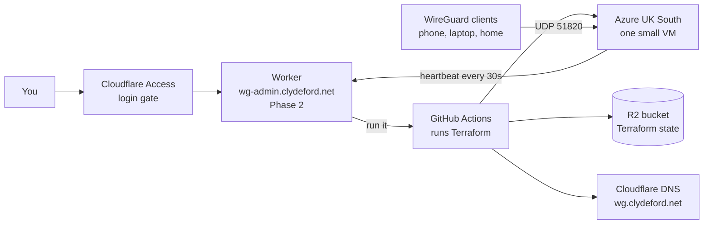

# wg-admin: an on-demand WireGuard concentrator in Azure

A VPN headend that only exists while you want it. One click builds a small
Azure VM running WireGuard, points **wg.clydeford.net** at it, and shows you
who is connected. Another click tears it all down and the Azure bill goes back
to £0. Your phones and laptops never change: they always dial the same name and
trust the same server key.

Everything that manages it runs on Cloudflare and GitHub, both on free tiers.
Nothing runs in the homelab except the WireGuard clients themselves.

> **Status:** Phase 1 (infrastructure and runner) is built. The dashboard
> (Phase 2) is next. Right now you deploy and destroy from the GitHub Actions
> tab. The full design is in [wg-admin-spec.md](wg-admin-spec.md).

## The picture



## The moving parts, in networking terms

| Part | What it is | Think of it as |
| --- | --- | --- |
| **Terraform** (`infra/`) | A description of every Azure object: resource group, VNet, subnet, NSG, public IP, NIC, VM, plus the DNS record. `apply` builds it, `destroy` removes it. | A config template you push to a new site, and pull back when the site closes |
| **cloud-init** (`infra/cloud-init.yaml.tftpl`) | A script Azure hands the VM on first boot. Installs WireGuard, writes its config, opens the tunnel, starts the heartbeat. | Zero-touch provisioning, like Cisco ZTP or a Meraki claiming itself |
| **The agent** (`infra/agent/`) | A 30-second systemd timer on the VM that POSTs `wg show` output to the Worker and applies any new peers the Worker sends back. | SNMP traps plus a tiny config-push channel |
| **GitHub Actions** (`.github/workflows/wg.yml`) | The machine that actually runs Terraform. It logs into Azure and Cloudflare with secrets, runs apply or destroy, backs up state, reports back. | The NOC engineer who types the change |
| **R2 bucket** `wg-admin-tfstate` | Where Terraform keeps its inventory of what it built. Locked during a run so two runs cannot collide. | The startup-config; lose it and the box still runs but you no longer know what you have |
| **wg.clydeford.net** | An A record, TTL 60, DNS-only (grey cloud). Written on apply, removed on destroy. | A DDNS name: the name is stable, the address behind it is disposable |
| **Cloudflare Access** | Login gate for the dashboard. Only stevie.johnston@gmail.com gets in. | MFA on the management plane |
| **The Worker** (Phase 2) | The dashboard and API at wg-admin.clydeford.net. | The management plane |

## Setup, once

You need: [Node.js](https://nodejs.org) 20+, [GitHub CLI](https://cli.github.com) (`gh auth login`), and
[Terraform](https://developer.hashicorp.com/terraform/install) 1.10+ for local validation.

1. **Fill in `.env`.** Copy `.env.example` to `.env` if you do not have one. Every
   key has a comment saying what it is and where to get it. The values marked
   `REPLACE_ME` are the only ones you must mint by hand; the comments tell you
   where in each dashboard to click.

2. **Server key.** If `WG_SERVER_PRIVATE_KEY` is blank:

   ```sh
   npm run keys
   ```

   This is the one key every client trusts. It is generated once and kept
   forever. `npm run keys` refuses to overwrite it unless you pass `--rotate`.

3. **Push secrets to GitHub.** Terraform in Actions reads them from there.

   ```sh
   npm run secrets -- --dry-run   # shows what it would set, never the values
   npm run secrets
   ```

   It refuses to run while any `REPLACE_ME` remains. If the narrow DNS token
   is not minted yet it will use the broad token with a loud warning, so you
   can test before tightening.

4. **Check the Terraform** (no cloud calls):

   ```sh
   npm run tf-validate
   npm test
   ```

## Using it (Phase 1: from the GitHub Actions tab)

### Make a client

```sh
npm run peer -- --name laptop --ip 10.13.13.2
```

This writes `peers/laptop.conf` (import it into the WireGuard app; it holds the
client's private key and is gitignored) and prints a `peers_json` payload. Use
`--full` for a full-tunnel (exit node) config, and `--home` to also route the
home LAN through the tunnel (only for a device that is away from home, and
only once site-to-site is built).

### Deploy

GitHub > **Actions** > **wg** > **Run workflow**:

- action: `apply`
- payload: paste the JSON that `npm run peer` printed, e.g.
  `{"peers_json":"[{\"name\":\"laptop\",\"public_key\":\"...\",\"ip\":\"10.13.13.2\"}]"}`

About three minutes later the run summary shows the public IP and
wg.clydeford.net resolves to it. Turn the tunnel on in the WireGuard app.

Optional payload keys: `region`, `vm_size`, `ssh_allowed_cidr` (e.g.
`"86.1.2.3/32"`; without it there is **no SSH rule at all**), `home_lan_cidr`,
`wg_port`, `wg_subnet`.

### Destroy

Same screen, action: `destroy`, payload `{}`. The workflow runs `terraform
destroy`, then double-checks with the Azure CLI that the resource group is gone
and with the Cloudflare API that the DNS record is gone, deleting either by
hand if Terraform missed it. The bill is £0 when the run is green.

### SSH to the VM (if you allowed it)

```sh
ssh -i ~/.ssh/wg-admin-azure_ed25519 azureuser@wg.clydeford.net
sudo wg show
sudo journalctl -t wg-agent
```

## What it costs

| State | Azure cost |
| --- | --- |
| Destroyed | £0.00. Nothing exists. |
| Running | About £8 a month for the B1s VM and 30 GB disk, plus about £2.60 for the static IP, billed per hour. Roughly 1.5p an hour. |

Cloudflare (Worker, D1, KV, R2, Access) and GitHub Actions stay within their
free tiers.

## Repository map

```
infra/                    Terraform: the Azure build and the DNS record
  cloud-init.yaml.tftpl   the VM's first-boot script
  agent/                  the heartbeat script and its systemd units
.github/workflows/wg.yml  the runner: apply or destroy
.github/workflows/ci.yml  checks on every push, no cloud calls
scripts/                  the npm commands (keys, peer, secrets, tf-validate)
wg-admin-spec.md          the full design
docs/runs/                records of each autonomous build session
```

## Glossary

- **Concentrator / headend**: the VPN server the clients dial into.
- **Peer**: WireGuard's word for the other end of a tunnel, client or server.
- **AllowedIPs**: on a client, which destinations go through the tunnel. Split
  tunnel = just the VPN and home ranges. Full tunnel = `0.0.0.0/0`.
- **NSG**: Azure's per-subnet firewall. Ours allows UDP 51820 from anywhere,
  SSH only from an allow-list, and denies everything else inbound.
- **Resource group**: an Azure folder. Deleting it deletes everything inside,
  which is how destroy can never leave a stray VM running.
- **State**: Terraform's record of what it built. Lives in R2, backed up on
  every run.
