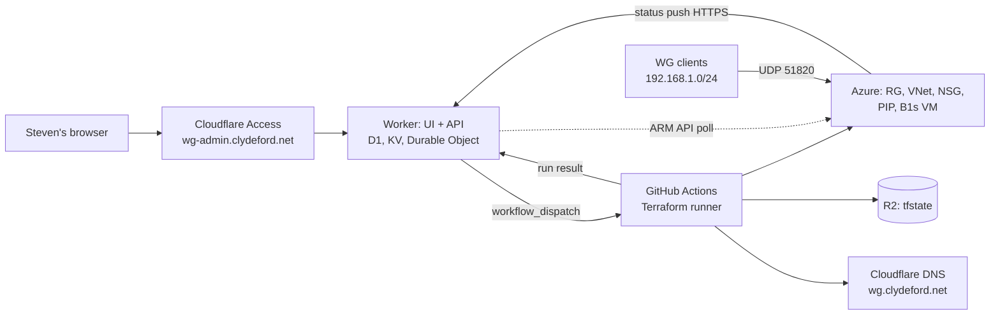
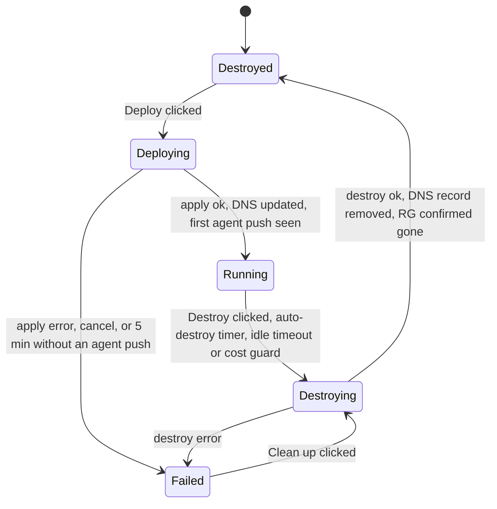

# WG Admin: On-Demand Azure WireGuard Concentrator Spec

Date: 2026-09-22 (revision 2, decisions resolved and bootstrap done). Owner: Steven.

## Purpose

Build a Cloudflare-hosted control panel at wg-admin.clydeford.net that creates, destroys and monitors an on-demand WireGuard concentrator in Azure, costing nothing while destroyed. One click builds the Azure VM with Terraform, writes its new public IP to wg.clydeford.net in Cloudflare DNS, and shows the tunnel's health. Another click tears everything down and the Azure bill returns to zero.

In networking terms: the Azure VM is a small VPN headend that only exists while you want it. The admin site is the management plane, running entirely on Cloudflare with GitHub Actions as the Terraform runner; nothing runs in the homelab. WireGuard clients at home never change; they always dial wg.clydeford.net:51820 and trust one fixed server key, so a rebuilt VM looks identical to them.

This spec is written for Claude Code to build from. Steven is not a coder: every design choice below should be implemented as described, and the README must explain each moving part in plain English with the networking analogies used here.

## Decisions

All decisions are made. Nothing in this table needs confirming before Phase 1.

| Item | Decision | Why |
| --- | --- | --- |
| Where the admin site runs | Cloudflare Worker (Hono), served at wg-admin.clydeford.net | Zero cost, nothing in the homelab |
| Who runs Terraform | GitHub Actions workflow in sjohnston1972/wireguard, triggered by the Worker via workflow_dispatch. **Confirmed.** The Bicep-from-Worker alternative is dropped | Workers cannot run Terraform; Actions is free within 2,000 minutes a month; the repo already exists |
| IaC tool | Terraform 1.10 or newer (needed for the S3 backend's native lockfile) | Steven already has Terraform installed and R2-backed state in another project |
| Who can reach wg-admin | Cloudflare Access app "wg-admin", allowing only stevie.johnston@gmail.com, signing in with Google or a one-time PIN (both identity providers pinned on the app, 2026-09-22) | MFA-grade login without writing an auth system. Google was already an identity provider in the Zero Trust org |
| Terraform state | R2 bucket wg-admin-tfstate as the S3 backend with `use_lockfile = true`. No Durable Object is involved in state locking | Zero cost; one true copy of state; the lockfile is native to Terraform 1.10+ |
| State backups | R2 has no object versioning, so the workflow copies tfstate to `backups/<timestamp>.tfstate` after every apply and destroy, keeping the last 20 | Recovery from a corrupt state without paying for anything |
| Worker storage | D1 (SQLite) for runs, peers, alerts and settings; KV for the live status blob; one Durable Object for the run lock | All free tier |
| Server WireGuard keypair | Generated once (done 2026-09-22), stored in .env, GitHub secrets and Worker secrets, never regenerated | Clients trust this key; it must survive every rebuild |
| Azure service principal | The existing SP is Contributor on the whole subscription. **Accepted for v1.** Terraform creates and deletes the resource group itself, which a resource-group-scoped SP could not do | Steven cannot re-scope it without Owner rights; tightening is backlog item 13 |
| Azure region | UK South | Lowest latency from Scotland |
| VM size | Standard_B1s (1 vCPU, 1 GB) on Ubuntu 24.04 LTS, 30 GB Standard SSD, plus a Standard static public IP | About £8 per month for the VM and £2.60 for the IP if left running; both vanish on destroy |
| Tunnel subnet | 10.13.13.0/24, server = 10.13.13.1 | Avoids home and Azure ranges |
| Azure VNet | 10.50.0.0/16 with one subnet 10.50.1.0/24 for the VM | Room to add workloads later |
| Home LAN | 192.168.1.0/24; WireGuard clients live here and dial out | Fixed for this build |
| DNS zone | clydeford.net (zone id 68c212a7f233ee505d871e816da19600); the app owns only wg.clydeford.net | Everything else in the zone is off limits |
| Cloudflare tokens | Two. CLOUDFLARE_API_TOKEN is the broad account token, used only on Steven's machine for bootstrap and wrangler. CLOUDFLARE_DNS_TOKEN is scoped to DNS:Edit on clydeford.net and is the only Cloudflare token that leaves the machine | Least privilege for anything stored in GitHub or the Worker |
| SSH allow-list | SSH_ALLOWED_CIDR if set, else the public IP that clicked Deploy (the request's CF-Connecting-IP), as a /32 | The Worker has no other way to know the home IP; this also works from a phone |
| Tooling | npm scripts in package.json (keys, secrets, deploy-worker, migrate, tf-validate), each a small Node script | `make` is not installed on Steven's Windows machine; npm is. Same verbs as the original Makefile plan |
| Peer push to a running VM | The agent's 30-second POST gets back the full desired peer set; it rewrites the [Peer] blocks in wg0.conf and runs `wg syncconf` | Reconciling the whole set is simpler and safer than incremental `wg set` commands |

## Bootstrapped so far (2026-09-22)

These exist and the values are already in .env. Do not recreate them.

| Thing | Value / location | How it was made |
| --- | --- | --- |
| GitHub repo | https://github.com/sjohnston1972/wireguard (public since 2026-09-22, see billing note below) | gh CLI |
| Cloudflare Access app | name wg-admin, domain wg-admin.clydeford.net, app id 51b8b50f-212d-4823-bedb-d51698fcf542, policy "Steven only" | Cloudflare API |
| Cloudflare zone id | 68c212a7f233ee505d871e816da19600 | Looked up |
| R2 bucket | wg-admin-tfstate, location WEUR | Cloudflare API |
| WireGuard server keypair | WG_SERVER_PRIVATE_KEY and WG_SERVER_PUBLIC_KEY in .env | Node X25519 |
| SSH keypair | ~/.ssh/wg-admin-azure_ed25519 (private), public key in .env | ssh-keygen |
| Azure | SP verified as subscription Contributor; rg-wg-ondemand does not exist yet, which is the correct Destroyed state | az CLI |
| DNS | wg.clydeford.net does not exist yet, which is correct | Cloudflare API |

Hand-minted values. Status after the 2026-09-22 session (Claude has no dashboard access, so stand-ins are in use where Cloudflare documents them):

- [ ] CLOUDFLARE_DNS_TOKEN: still REPLACE_ME. `npm run secrets` pushed the BROAD token to GitHub and (from 2026-09-22 evening, matching Steven's wide-token choice for GitHub) to the Worker as a stand-in, with a warning. Mint the narrow one at dashboard > My Profile > API Tokens > Create Token > "Edit zone DNS" template, zone = clydeford.net only, then rerun `npm run secrets`
- [x] R2_ACCESS_KEY_ID and R2_SECRET_ACCESS_KEY: filled with credentials derived from the broad token (key id = token id, secret = sha256 of the token, a documented Cloudflare method). Works, proven by two runs. Replace with a bucket-scoped pair when convenient
- [x] GITHUB_TOKEN: **Steven chose (2026-09-22) to use the gh CLI's OAuth token** (scopes repo, workflow, read:org, gist) instead of a fine-grained PAT. Pushed to the Worker; the Deploy button is live. Tightening to a repo-scoped PAT is a later hardening step. github.com > Settings > Developer settings > Fine-grained tokens, repository = sjohnston1972/wireguard only, permissions Actions: Read and write, Contents: Read
- [x] wrangler 4.136.3 installed globally. No `wrangler login` needed: it can use CLOUDFLARE_API_TOKEN from the environment, which the deploy-worker script will do
- [x] **GitHub Actions billing block, resolved by making the repo public** (2026-09-22). The first CI run refused to start: "recent account payments have failed or your spending limit needs to be increased". Public repos get free Actions minutes, and nothing in the repo is secret (verified: no token or key in any commit). If Steven prefers private, fix github.com/settings/billing first, then `gh repo edit --visibility private`.

## Architecture

Four planes: the Worker (management), GitHub Actions plus Terraform and cloud-init (provisioning), the WireGuard VM (data), and Cloudflare on the edge for login, DNS and storage. Nothing runs at home except the WireGuard clients.



Reading it left to right: Steven logs in through Cloudflare Access, the Worker asks GitHub Actions to run Terraform, Actions builds Azure and writes the DNS record, then reports back. The VM pushes its own health to the Worker. Clients only ever see the DNS name.

### Components

| Component | Runs where | Job |
| --- | --- | --- |
| wg-admin Worker | Cloudflare Workers, custom domain wg-admin.clydeford.net (wrangler creates the DNS record for the custom domain) | UI, API, triggers runs, receives callbacks, cron pollers |
| D1 database | Cloudflare | Runs, peers, alerts, settings, cost history |
| KV | Cloudflare | Current state badge, public IP and last agent report, read on every page load |
| Durable Object | Cloudflare | Single run lock |
| R2 bucket wg-admin-tfstate | Cloudflare | Terraform state, state backups and rendered peer configs |
| GitHub Actions workflow | GitHub, free tier | Runs terraform init/apply/destroy with secrets from repo secrets and inputs from the Worker's dispatch call; posts result to the Worker |
| Cloudflare Access | Cloudflare Zero Trust, free tier | Login gate |
| Azure resources | UK South | RG, VNet, subnet, NSG, static PIP, NIC with IP forwarding, B1s VM |
| WireGuard on the VM | Kernel module, wg-quick@wg0 via cloud-init | The VPN headend |
| VM status agent | systemd timer on the VM | POSTs wg show output to the Worker every 30 seconds with a bearer token; reconciles peers from the response |
| Cloudflare DNS | clydeford.net zone | wg.clydeford.net A record, TTL 60 |

### Lifecycle



The Worker must always be able to tell which state it is in, even after a failed run, by reading the Actions run status and querying Azure rather than trusting its own KV entry. KV is a cache of the truth, never the truth.

## Infrastructure as code

One Terraform root module in `infra/`, run only by the GitHub Actions workflow in `.github/workflows/wg.yml`. Every resource is created on apply and removed on destroy so the Azure bill is zero when destroyed.

### Terraform resources

| Resource | Notes |
| --- | --- |
| azurerm_resource_group | Name from AZURE_RESOURCE_GROUP (rg-wg-ondemand); destroying it removes everything below |
| azurerm_virtual_network | 10.50.0.0/16 |
| azurerm_subnet | 10.50.1.0/24 |
| azurerm_network_security_group | Inbound allow UDP 51820 from any; inbound allow TCP 22 only from var.ssh_allowed_cidr; deny all else |
| azurerm_public_ip | Standard SKU, static allocation; destroyed with the rest |
| azurerm_network_interface | enable_ip_forwarding = true (Azure drops forwarded packets otherwise) |
| azurerm_linux_virtual_machine | Standard_B1s, Ubuntu 24.04 LTS (publisher Canonical, offer ubuntu-24_04-lts, sku server), admin user azureuser, SSH key only, custom_data = rendered cloud-init |
| azurerm_route_table + association | Only when var.home_lan_cidr is set: route home_lan_cidr via the VM's private IP, so future Azure workloads can reach home |
| cloudflare_dns_record | wg.clydeford.net A record = azurerm_public_ip.ip_address, TTL 60, proxied = false. Cloudflare provider 5.x renamed cloudflare_record to cloudflare_dns_record |

Outputs: public_ip, vm_private_ip, resource_group, server_public_key and a timestamp. The workflow reads these with `terraform output -json` and posts them to the Worker callback. No output may contain a private key.

### Variables

Static secrets are GitHub repository secrets, set once from .env by `npm run secrets`:

| GitHub secret | From .env |
| --- | --- |
| ARM_CLIENT_ID, ARM_CLIENT_SECRET, ARM_TENANT_ID, ARM_SUBSCRIPTION_ID | AZURE_* |
| CLOUDFLARE_DNS_TOKEN, CLOUDFLARE_ZONE_ID | same |
| R2_ACCESS_KEY_ID, R2_SECRET_ACCESS_KEY, R2_BUCKET, CLOUDFLARE_ACCOUNT_ID | same (backend endpoint is https://<account id>.r2.cloudflarestorage.com) |
| SSH_PUBLIC_KEY | same |
| WG_SERVER_PRIVATE_KEY | same |

Per-run inputs are passed by the Worker in the workflow_dispatch payload and become TF_VAR_ variables in the job: action (apply or destroy), region, vm_size, peers_json, home_lan_cidr, ssh_allowed_cidr, wg_dns_name, wg_port, wg_subnet, agent_token, callback_url, callback_token, run_id. GitHub caps dispatch inputs at 10, so the workflow takes one `payload` input holding a JSON string plus `action`, and a first job step splits it into TF_VAR_ environment variables.

### Cloud-init

Rendered with templatefile(). It must:

1. Install wireguard, qrencode and curl via apt.
2. Set net.ipv4.ip_forward = 1 persistently.
3. Write /etc/wireguard/wg0.conf from the fixed server private key and the peer map, with PostUp and PostDown iptables rules that masquerade tunnel traffic out of the default interface (looked up at boot, not hard-coded to eth0).
4. Enable wg-quick@wg0.
5. Install a tiny status agent (a shell script plus a systemd service and timer) that every 30 seconds POSTs the output of `wg show wg0 dump`, uptime and load to https://wg-admin.clydeford.net/api/agent with a per-deploy bearer token baked in by cloud-init. The Worker stores the report in KV so the dashboard shows live peer handshakes. The response carries the full desired peer list; if it differs from what is running, the agent rewrites the [Peer] blocks in wg0.conf and runs `wg syncconf wg0 <(wg-quick strip wg0)`.
6. Enable unattended-upgrades.

Plain English: cloud-init is the VM's zero-touch provisioning script, the same idea as a Cisco ZTP or Meraki claiming a device. The VM boots, configures itself, and is ready without anyone logging in.

### Key handling

- The server keypair was generated once by `npm run keys` (X25519) and lives in .env, GitHub secrets and Worker secrets. `npm run keys` refuses to overwrite an existing key unless passed `--rotate`.
- Its public key is shown in the UI so client configs can be built.
- The private key lands only in /etc/wireguard on the VM, via a sensitive Terraform variable rendered into cloud-init.
- Rotating the key is a deliberate, confirmed action that warns every client config must be reissued.

### State

`wg-admin/terraform.tfstate` lives in the R2 bucket using the S3 backend with `use_lockfile = true` and the R2-specific skip flags (skip_credentials_validation, skip_region_validation, skip_requesting_account_id, skip_metadata_api_check, skip_s3_checksum). After every apply and destroy the workflow copies the state to `backups/<timestamp>.tfstate` and prunes to the last 20. A destroy with a missing or corrupt state must fall back to deleting the resource group by name via the Azure CLI, so a stuck VM can never keep costing money. The Cloudflare DNS record is removed the same way as a fallback.

## Admin web app: wg-admin.clydeford.net

A single-page, mobile-friendly dashboard. The point is one glance and one click: is it up, what does it cost, deploy or destroy.

### Pages

| Page | Contents |
| --- | --- |
| Dashboard | Big state badge (Destroyed / Deploying / Running / Destroying / Failed), current public IP, DNS record value and whether it matches, uptime, running cost so far this session, Deploy and Destroy buttons, auto-destroy countdown |
| Peers | Table of clients: name, tunnel IP, public key, last handshake, bytes in/out, online indicator. Add, disable, delete peer. Show config and QR code for a peer |
| Activity | Live relayed log of the current Actions run, plus a history table of every deploy and destroy with duration, result and cost |
| Settings | Region, VM size, auto-destroy default, notification settings, server public key, key rotation, state backup status |
| Cost | Chart of spend per session and cumulative for the month, from Azure Cost Management |

### Actions

- Deploy: the Worker records a run in D1, takes the Durable Object lock, generates the agent token and callback token, and calls the GitHub API workflow_dispatch with action=apply. It then polls the Actions run status every 10 seconds and relays the job log to the browser. When Actions posts the result callback (public IP, outputs), the Worker checks DNS and waits for the first agent push or a 5 minute timeout.
- Destroy: same path with action=destroy. Actions verifies via the Azure API that the resource group is gone, verifies the DNS record is gone, then calls back. Requires a typed confirmation word.
- Cancel: the Worker cancels the Actions run via the API and marks the run Failed; a Clean up button then dispatches a destroy.
- Add peer: generates a client keypair in the browser (WebCrypto X25519, private key never sent to the Worker), assigns the next free 10.13.13.x, stores name, public key and IP in D1, shows the .conf and QR code. If the VM is Running, the new peer appears in the next agent response and the agent applies it, so no rebuild is needed. All peers are included in the next cloud-init render.
- Export peer config: download .conf, or copy, with the endpoint always wg.clydeford.net:51820. The config is only ever shown once at creation time because the Worker never has the private key.

### Concurrency

Only one run at a time. A Durable Object holds the lock; a second request gets a clear "run in progress" message and a link to the live log. The workflow itself also uses GitHub's concurrency group so two runs can never overlap even if the lock is bypassed.

### Auth

Cloudflare Access handles login for the UI. The Worker must validate the `Cf-Access-Jwt-Assertion` header on every UI and API request: fetch the JWKS from https://clydeford.cloudflareaccess.com/cdn-cgi/access/certs (cached), check the signature, the `aud` claim equals CF_ACCESS_AUD, and the `email` claim equals CF_ACCESS_ALLOWED_EMAIL. Two routes are exempt and use their own bearer tokens: /api/agent (VM status push, per-deploy token) and /api/callback (Actions result, token generated per run). No local user database.

## Cloudflare DNS: wg.clydeford.net

The record is owned by Terraform (cloudflare_dns_record) so it is created and removed in the same apply and destroy as the VM. The Worker adds a belt-and-braces check on top.

- Record: A, wg.clydeford.net, TTL 60, DNS only (grey cloud). WireGuard is UDP, so the record must never be proxied.
- After apply the Worker queries Cloudflare's API and 1.1.1.1 (DNS over HTTPS) until both return the new IP, and shows "DNS live" on the dashboard.
- After destroy the record is removed. Clients that dial while destroyed get NXDOMAIN, which fails fast rather than hanging.
- Terraform and the Worker use CLOUDFLARE_DNS_TOKEN, scoped to Zone:DNS:Edit on clydeford.net only.
- The app must never touch any other record in the zone; a unit test asserts the record name, and the Terraform module takes the zone id from a variable and the name from WG_DNS_NAME.

Why a DNS name rather than a fixed IP: a static Azure IP costs money while the VM is gone. The name is the stable identity; the address behind it is disposable. Same idea as a DDNS name on a home router.

## Monitoring

The dashboard shows truth from three sources, and disagreement between them is itself an alert.

| Source | What it tells us | How often |
| --- | --- | --- |
| Actions run status and callback | What Terraform believes it built | On every run |
| Azure Resource Manager API | What actually exists, VM power state, public IP | Worker cron every 5 minutes while not Destroyed |
| VM status agent push | WireGuard peers, last handshake per peer, transfer counters, VM uptime and load | Every 30 seconds while Running; missing for 2 minutes = Unreachable |

Checks and alerts:

- Drift: Azure says a resource group exists but state says Destroyed, or vice versa. Show a red banner with a Reconcile button.
- Cost guard: if the VM has been Running longer than the auto-destroy window plus 15 minutes, destroy it and notify.
- Handshake watchdog: Running but no peer handshake for 10 minutes is shown as Idle; IDLE_DESTROY_MINUTES (0 = off) can trigger auto-destroy.
- DNS mismatch: record value differs from the Azure PIP.
- Notifications: optional webhook (Discord, Slack, ntfy, or generic) on deploy complete, destroy complete, failure, drift, and cost guard. Configured by NOTIFY_WEBHOOK_URL, off by default.

All checks run from a Worker cron trigger every 5 minutes and write to D1 so the Activity page can show what happened while Steven was not looking.

## Value-add features

Build in priority order. Items 1 to 4 are in scope for v1; the rest are backlog for Claude Code to pick up once the core works.

1. Auto-destroy timer. Deploy asks "for how long?" (1h, 4h, 8h, until midnight, indefinite). The countdown shows on the dashboard and can be extended. This is the single biggest cost saver.
2. Live cost meter. Estimated £ per hour from the VM SKU, disk and public IP, ticking up on the dashboard, with actual figures pulled from Azure Cost Management once a day. Monthly total and a soft budget (MONTHLY_BUDGET_GBP) with a warning.
3. Peer QR codes and one-tap mobile setup. Add a phone in under a minute.
4. Wake from phone. Done as a PWA: the dashboard has a web manifest, installs to the home screen, and the Access session lasts 24 hours, so Deploy is two taps. The signed one-time URL variant was dropped: it would need an Access bypass on a login-free route, which is a worse trade than the PWA.
5. Deploy profiles. Named presets that change region and VM size: "UK lab", "US exit node", "EU exit node". Same clients, different geography. Changing the profile is a destroy and deploy.
6. Exit-node mode toggle. Per peer, generate a full-tunnel config (AllowedIPs 0.0.0.0/0) with the DNS pushed set to 1.1.1.1, alongside the split-tunnel one.
7. Site-to-site to home. When HOME_LAN_CIDR and HOME_WG_PUBLIC_KEY are set, the app also manages the peer entry for the home WireGuard container and prints the static route Steven needs on his home router.
8. Speed test. A button that runs iperf3 between the VM and the home container over the tunnel and charts throughput and latency.
9. Health page over the tunnel. A read-only status page served by the VM at http://10.13.13.1:8080 so any connected client can see who else is on.
10. Scheduled windows. Cron-style rules such as "up weekdays 08:00 to 18:00", for a workday exit node.
11. Ephemeral jump host. Optional second cloud-init role that also installs Docker and a browser-based terminal (ttyd), reachable only over the tunnel, giving a throwaway Linux box in Azure on demand.
12. Terraform plan preview. Show the plan diff in the UI before apply so Steven can see, in plain English, what is about to be created, changed or destroyed.
13. Least-privilege Azure. Pre-create rg-wg-ondemand permanently (an empty resource group costs nothing), change Terraform to use it as a data source, and re-scope the service principal to Contributor on that group plus Cost Management Reader on the subscription. Needs Steven to run the role assignment as Owner.

## Security requirements

- Azure credentials are the existing service principal. v1 accepts subscription-wide Contributor (see Decisions); backlog item 13 tightens it. Never Owner.
- Only CLOUDFLARE_DNS_TOKEN (DNS:Edit on clydeford.net) leaves Steven's machine. The broad CLOUDFLARE_API_TOKEN is never pushed to GitHub or the Worker. Until the DNS token is minted, `npm run secrets` falls back to the broad token and prints a loud warning.
- GitHub fine-grained token held by the Worker, scoped to Actions read/write and Contents read on this one repository only.
- Static secrets live as GitHub repository secrets and Worker secrets (`wrangler secret put`); none in the repo, none in wrangler.toml, none in logs. Terraform variables containing keys are marked sensitive and never appear in outputs or the callback.
- The Worker validates the Cloudflare Access JWT on every request and refuses to serve if CF_ACCESS_AUD or CF_ACCESS_ALLOWED_EMAIL is unset.
- /api/agent and /api/callback require bearer tokens generated per deploy or per run, stored as SHA-256 hashes in D1, and are rate limited.
- The VM accepts SSH only from SSH_ALLOWED_CIDR or the deployer's IP, and only with the SSH key in secrets. Password auth disabled.
- The NSG is deny-by-default with two inbound rules: UDP 51820 from any, TCP 22 from the allow-list.
- Client private keys are generated in the browser and never leave it.
- Destroy and key rotation require typed confirmation.
- Terraform, provider and Actions versions are pinned; Dependabot enabled on the repo.

## .env contract

The `.env` file is the single place Steven fills in. It is gitignored. `npm run secrets` pushes each value to the right home: GitHub repository secrets for anything Terraform needs (via the gh CLI, already logged in on this machine), Worker secrets for anything the Worker needs (via wrangler). `.env.example` lists every key with a one-line plain-English comment. The Worker refuses to serve if any required value is missing, and `npm run secrets` refuses to push a value still set to REPLACE_ME.

| Key | Required | Goes to | Meaning |
| --- | --- | --- | --- |
| AZURE_SUBSCRIPTION_ID, AZURE_TENANT_ID, AZURE_CLIENT_ID, AZURE_CLIENT_SECRET | yes | GitHub (as ARM_*), Worker | Service principal |
| AZURE_RESOURCE_GROUP | yes | GitHub, Worker | rg-wg-ondemand |
| AZURE_REGION | no | Worker | Default uksouth |
| AZURE_VM_SIZE | no | Worker | Default Standard_B1s |
| CLOUDFLARE_API_TOKEN | yes | local only | Broad token for bootstrap and wrangler |
| CLOUDFLARE_ACCOUNT_ID | yes | GitHub, Worker (wrangler) | R2 endpoint; D1, KV, R2 bindings |
| CLOUDFLARE_ZONE_ID | yes | GitHub, Worker | Zone id for clydeford.net |
| CLOUDFLARE_DNS_TOKEN | yes | GitHub, Worker | DNS:Edit on clydeford.net only |
| CF_ACCESS_TEAM_DOMAIN | yes | Worker | clydeford.cloudflareaccess.com |
| CF_ACCESS_AUD | yes | Worker | Audience tag of the wg-admin Access app |
| CF_ACCESS_ALLOWED_EMAIL | yes | Worker | The one email allowed in |
| R2_BUCKET, R2_ACCESS_KEY_ID, R2_SECRET_ACCESS_KEY | yes | GitHub | Terraform state backend |
| WG_SERVER_PRIVATE_KEY | yes | GitHub, Worker | Must be kept forever |
| WG_SERVER_PUBLIC_KEY | no | Worker | Derived; shown in UI |
| WG_DNS_NAME | no | GitHub, Worker | Default wg.clydeford.net |
| WG_PORT | no | GitHub, Worker | Default 51820 |
| WG_SUBNET | no | GitHub, Worker | Default 10.13.13.0/24 |
| HOME_LAN_CIDR | no | Worker | Default 192.168.1.0/24; enables site-to-site routing |
| HOME_WG_PUBLIC_KEY | no | Worker | Home concentrator's key, needed for site-to-site |
| SSH_ALLOWED_CIDR | no | Worker | Blank = deployer's IP |
| SSH_PUBLIC_KEY | yes | GitHub | Admin key for the VM (private half in ~/.ssh/wg-admin-azure_ed25519) |
| GITHUB_REPO | yes | Worker | sjohnston1972/wireguard |
| GITHUB_TOKEN | yes | Worker | Fine-grained PAT, Actions read/write on the repo |
| GITHUB_WORKFLOW | no | Worker | Default wg.yml |
| AUTO_DESTROY_DEFAULT_HOURS | no | Worker | Default 4 |
| IDLE_DESTROY_MINUTES | no | Worker | Default 0 (off) |
| MONTHLY_BUDGET_GBP | no | Worker | Default 10 |
| NOTIFY_WEBHOOK_URL | no | Worker | Deploy/destroy/alert notifications |

## Repository layout and tech stack

Keep it to one language for the Worker so Steven has one thing to learn. TypeScript is the only practical choice on Workers; keep it simple, typed and commented.

| Part | Choice |
| --- | --- |
| Worker | TypeScript, Hono router, server-rendered HTML with HTMX; no build step beyond wrangler |
| Storage | D1 (SQLite) for records, KV for live status, R2 for tfstate and configs, one Durable Object for the run lock |
| Cron | Worker cron trigger every 5 minutes for pollers, cost guard, auto-destroy |
| IaC | Terraform 1.10+, azurerm 4.x and cloudflare 5.x providers pinned, S3 backend on R2 with lockfile |
| Runner | GitHub Actions workflow with workflow_dispatch inputs and a concurrency group |
| Tooling | npm scripts: keys, peer, secrets, deploy-worker, migrate, tf-validate, test (Node scripts in scripts/). `npm run peer` makes a client config locally for manual testing; the dashboard replaces it in Phase 3 |
| Tests | node:test for the scripts (vitest for the Worker from Phase 2); CI runs `terraform fmt`, `terraform validate`, and renders the cloud-init with fake values and parses it as YAML. No plan job: the azurerm provider cannot plan without real credentials |

```
wireguard/                 (repo root, this directory)
  README.md                plain-English walkthrough, architecture picture, glossary
  wg-admin-spec.md         this file
  .env.example
  .gitignore
  package.json             npm scripts: keys, secrets, deploy-worker, migrate, tf-validate, test
  scripts/                 the Node scripts behind those npm verbs, plus scripts/test/
  wrangler.toml            bindings for D1, KV, R2, Durable Object, cron, custom domain
  worker/
    src/
      index.ts             Hono app and routes
      auth.ts              Cloudflare Access JWT check, bearer tokens
      runs.ts              dispatch, poll and callback handling for Actions
      azure.ts             ARM and Cost Management queries
      dns.ts               DNS verification (Terraform owns the record)
      peers.ts             peer records, config and QR rendering
      monitor.ts           cron: drift, cost guard, watchdog, auto-destroy
      lock.ts              Durable Object
      views/               HTML templates
    migrations/            D1 schema
    test/
  infra/
    main.tf variables.tf outputs.tf providers.tf backend.tf
    cloud-init.yaml.tftpl
    agent/                 status agent script and systemd units, embedded by cloud-init
  .github/workflows/
    wg.yml                 apply or destroy, called by the Worker
    ci.yml                 tests and terraform validate
  docs/runs/               archived PLAN.md and PROGRESS.md from each autonomous run
```

Every module starts with a docstring explaining, in plain English, what it does and which networking idea it maps to.

## Build phases and acceptance criteria

Each phase ends with something Steven can click. Do not start the next until the acceptance line passes.

| Phase | Delivers | Accepted when |
| --- | --- | --- |
| 0. Bootstrap | Repo, Access app, R2 bucket, keys, .env, this spec | Done 2026-09-22 |
| 1. IaC and runner | Terraform module, cloud-init, agent, R2 backend, wg.yml and ci.yml workflows, npm scripts (keys, peer, secrets, tf-validate, test), README first draft. **Accepted 2026-09-22.** Apply run 35758942841: 4m35s to a running headend, DNS live via API and 1.1.1.1, laptop peer loaded, agent timer ticking. Tunnel proven with a throwaway client in a network namespace on the VM: handshake, ping both ways, and internet via NAT. Destroy run 35759700105: RG gone, zero tagged resources in the subscription, NXDOMAIN, state backed up. Not yet done: a handshake from a real phone or laptop across the internet (no WireGuard client on Steven's machine); `peers/laptop.conf` is ready to import | Triggering the workflow by hand from GitHub gives a working tunnel from a laptop within 3 minutes; destroy leaves the resource group gone and the Azure cost page at £0 |
| 2. Minimal Worker | Dashboard with state badge, Deploy, Destroy, live log relay; Cloudflare Access enforced; custom domain live. **Deployed 2026-09-22** at wg-admin.clydeford.net: Hono + htmx, D1/KV/R2/Durable Object, Access JWT verified via JWKS, /api/agent and /api/callback behind their own Access bypass apps and per-run tokens. Also delivered early from later phases: Clients page with browser-side X25519 keys and QR (Phase 3), agent push/reconcile (Phase 3), auto-destroy timer, cost guard, idle tear-down, drift detection, heartbeat watchdog, notifications (Phase 4), cost page with Azure Cost Management (Phase 5), settings overrides, PWA manifest for wake-from-phone. Lifecycle verified locally with a simulated callback and heartbeat. **Acceptance (a deploy from a phone) is blocked on GITHUB_TOKEN**, which Steven must mint | Same result as Phase 1 from a phone browser at wg-admin.clydeford.net |
| 3. Peers | Peers page, browser-side key generation, QR codes, agent push and live handshake status | A new phone is connected in under 60 seconds and shows Online |
| 4. Safety | Auto-destroy, cost guard, drift detection, notifications | Leaving the VM running past the timer results in an automatic destroy and a notification |
| 5. Value-add | Cost chart, profiles, exit-node configs, wake-from-phone | Steven can switch to a US exit node from his phone in two taps |
| 6. Backlog | Speed test, schedules, jump host, plan preview, least-privilege Azure | As prioritised by Steven |

Definition of done for the whole project:

- [ ] Destroyed state costs £0.00 in Azure, verified on the cost page after 24 hours
- [ ] No client config has changed across ten deploy/destroy cycles
- [ ] README lets someone who is not a coder go from a fresh clone to a live wg-admin.clydeford.net with only .env filled in and `npm run secrets`, `npm run migrate`, `npm run deploy-worker`
- [ ] All secrets absent from the repo and from logs
